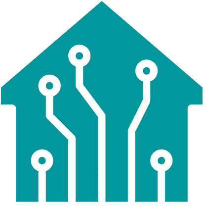

<!-- PROJECT LOGO -->
 

  

<h3 align="center">Smart Room</h3>

  

    A fully local smart home system built with largely available hardware components based on Esp and Arduino platforms.  
    MQTT is used as the main communication protocol.
  

 
 
 
 
 

## Overview

    

<!-- TABLE OF CONTENTS -->

  
Components

  <ul>
    <li><a href="#controlbox">ControlBox</a></li>
    <li><a href="#sensorbox">SensorBox</a></li>
    <li><a href="#arduinofan">ArduinoFan</a></li>
    <li><a href="#controller">Controller</a></li>
    <li><a href="#mobileapp">MobileApp</a></li>
  </ul>

  The purpose of this project is light and airflow control of a room the management of 3 devices through manual or automatic control. 

 

<!-- CONTROLBOX -->
## ControlBox

The purpose of this project is light and airflow control of a room the management of 3 devices through manual or automatic control.
 
 
 
 
 
 
 
 
 
 

  
Details

  

    
    

      The purpose of this project is light and airflow control of a room the management of 3 devices through manual or automatic control. 
    
 
  

  

    
    

      The purpose of this project is light and airflow control of a room the management of 3 devices through manual or automatic control. 
    
 
  

  

    
    

      The purpose of this project is light and airflow control of a room the management of 3 devices through manual or automatic control. 
    
 
  

<!-- SENSORBOX -->
## SensorBox

The purpose of this project is light and airflow control of a room the management of 3 devices through manual or automatic control.
 
 
 
 
 
 
 
 
 
 
 

  
Details

  

    
    

      The purpose of this project is light and airflow control of a room the management of 3 devices through manual or automatic control. 
    
 
  

  

    
    

      The purpose of this project is light and airflow control of a room the management of 3 devices through manual or automatic control. 
    
 
  

  

    
    

      The purpose of this project is light and airflow control of a room the management of 3 devices through manual or automatic control. 
    
 
  

<!-- ARDUINOFAN -->
## ArduinoFan

The purpose of this project is light and airflow control of a room the management of 3 devices through manual or automatic control.
 
 
 
 
 
 
 
 
 
 
 
 
 
 

  
Details

  

    
    

      The purpose of this project is light and airflow control of a room the management of 3 devices through manual or automatic control. 
    
 
  

  

    
    

      The purpose of this project is light and airflow control of a room the management of 3 devices through manual or automatic control. 
    
 
  

<!-- CONTROLLER -->
## Controller

The purpose of this project is light and airflow control of a room the management of 3 devices through manual or automatic control.
 
 
 
 
 
 
 
 
 
 
 
 

<!-- MOBILEAPP -->
## MobileApp

The purpose of this project is light and airflow control of a room the management of 3 devices through manual or automatic control.
 
 
 
 
 
 
 
 
 
 
 
 