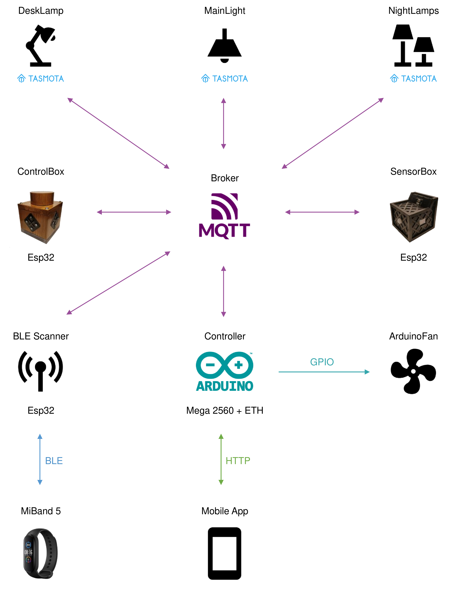

<!-- PROJECT LOGO -->

  
  <h1 align="center">Smart Room</h1>
  

  A fully local smart home system built with largely available hardware components. It is based on ESP and Arduino platforms.
  MQTT is used as the main communication protocol. 
  

 
 
 

## Overview

    

<!-- TABLE OF CONTENTS -->

  
Components

  <ul>
    <li><a href="#controlbox">ControlBox</a></li>
    <li><a href="#sensorbox">SensorBox</a></li>
    <li><a href="#arduinofan">ArduinoFan</a></li>
    <li><a href="#controller">Controller</a></li>
    <li><a href="#mobileapp">MobileApp</a></li>
  </ul>

  The system manages 3 points of light and the airflow in a room. It has two modes of operation: 

 
<ul>
  <li>
    

      Manual 
      the user can interact with the devices by using the ControlBox, in fact touching the black metal plates turns the devices ON and OFF and the dial on top can be used to select a device and set its intensity(fan speed, light intensity). The same can be done through the android app.
    
 
  </li>
  <li>
    

      Auto this mode is enabled by the user through the app. When enabled the controller manages the devices according to the scenario, sensor data and user defined settings. The following image shows the general flow control.
    

    

      
    

  </li>
</ul>

<!-- CONTROLBOX -->
## ControlBox

This device is a control panel that lets the user to interact with some of the devices. It has 3 capacitive sensors made with metal plates that function as toggle buttons. On top it has a Rotary Encoder with an integrated switch button. By pushing the button the user can select a device and by rotating the dial a new intensity level can be set for the specified device. At the bottom there is a LED Ring that is programmed to give the user visual feedback on the performed actions. The device is always listening for messages regarding the devices it can control to keeo in sync with their states.
 
 
 
 
 
 

  
More

  

    
  

   
  

    
  

    
  

    
    
<pre>
      1. Rotary Encoder KY-040          2. WS2812B 5050 RGB LED Ring
    </pre>
 
  

<!-- SENSORBOX -->
## SensorBox

This is a simple multisensor that reads the temperature, humidity, light intensity and motion in a room. The data is mainly used by the system when operating in Auto Mode. Temperature and humidity are also shown in the app.
 
 
 
 
 
 
 
 
 
 

  
More

  

    
  

   
  

    
  

   
  

    
    
<pre>
      1. TSL2591       2.PIR AM312      3.Temp/Hum DHT22
    </pre>
 
  

<!-- ARDUINOFAN -->
## ArduinoFan

The fan is built with a 3-phase BLDC motor salvaged from an old printer. An Electronic Speed Controller(ESC) powered by an external power supply is used to syncronize the three phases and thus controlling the speed. The system Controller(Arduino) communicates with the ESC through the Data pin with PWM.
 
 
 
 
 
 
 
 
 
 
 

  
More

  

    
  

   
  

    
  

<!-- CONTROLLER -->
## Controller

The purpose of this project is light and airflow control of a room the management of 3 devices through manual or automatic control.
 
 
 
 
 
 
 
 
 
 
 
 

<!-- MOBILEAPP -->
## MobileApp

The purpose of this project is light and airflow control of a room the management of 3 devices through manual or automatic control.
 
 
 
 
 
 
 
 
 
 
 
 
